# Aegion — Complete Runtime Flow Reference

> **Last updated**: 2026-02-13
> This document traces **every user-facing flow** from the VS Code extension through the backend API.
> It is the single source of truth for understanding what Aegion can do at runtime.

---

## Table of Contents

1. [System Architecture Overview](#1-system-architecture-overview)
2. [Extension Activation](#2-extension-activation)
3. [Session Lifecycle](#3-session-lifecycle)
4. [Proposal & Governance Pipeline](#4-proposal--governance-pipeline)
5. [AI Council](#5-ai-council)
6. [Evidence Graph](#6-evidence-graph)
7. [Decision Management](#7-decision-management)
8. [Architecture & ADRs](#8-architecture--adrs)
9. [Governance Controls](#9-governance-controls)
10. [Sentinel — Drift & Risk Monitoring](#10-sentinel--drift--risk-monitoring)
11. [Noesis — Cognitive Analytics](#11-noesis--cognitive-analytics)
12. [Ghost Text — Inline Completions](#12-ghost-text--inline-completions)
13. [Praxis — Code Sandbox](#13-praxis--code-sandbox)
14. [Chronos — Time Travel & Snapshots](#14-chronos--time-travel--snapshots)
15. [Memory & Context](#15-memory--context)
16. [Rules Engine](#16-rules-engine)
17. [Skills Marketplace](#17-skills-marketplace)
18. [Task Inbox](#18-task-inbox)
19. [Checkpoints — Git Safety](#19-checkpoints--git-safety)
20. [Collaboration & Presence](#20-collaboration--presence)
21. [War Room — Incident Response](#21-war-room--incident-response)
22. [Cloud Delegation](#22-cloud-delegation)
23. [Diff Review & Proposals](#23-diff-review--proposals)
24. [Audit Trail](#24-audit-trail)
25. [ChatOps Integration](#25-chatops-integration)
26. [MCP Tool Server](#26-mcp-tool-server)
27. [Terminal & Browser Tools](#27-terminal--browser-tools)
28. [AI Commands](#28-ai-commands)
29. [Model Routing](#29-model-routing)
30. [Agent Identity & Verification](#30-agent-identity--verification)
31. [Secrets Vault](#31-secrets-vault)
32. [Rejection Learning](#32-rejection-learning)
33. [Decision Pipelines](#33-decision-pipelines)
34. [Reasoning Chains](#34-reasoning-chains)
35. [Admin Dashboard](#35-admin-dashboard)
36. [Event Streaming (SSE)](#36-event-streaming-sse)
37. [WebSocket Real-Time](#37-websocket-real-time)
38. [Health & Readiness](#38-health--readiness)
39. [Configuration & Networking](#39-configuration--networking)
40. [Middleware & Guards](#40-middleware--guards)
41. [Authentication & Authorization](#41-authentication--authorization)
42. [Knowledge Graph Infrastructure](#42-knowledge-graph-infrastructure)
43. [Durable Storage & Crash Safety](#43-durable-storage--crash-safety)
44. [Observability & Tracing](#44-observability--tracing)
45. [Data Governance & Isolation](#45-data-governance--isolation)

---

## 1. System Architecture Overview

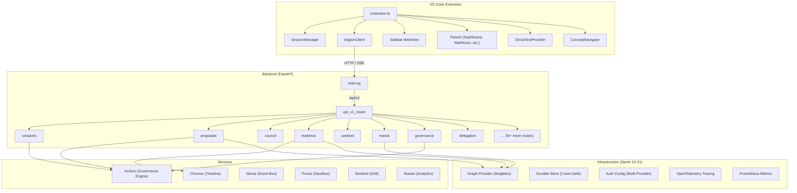

### URL Construction

```
Full URL = baseUrl + endpoint
         = "http://localhost:8000" + "/api/v1/sessions/start"
         = "http://localhost:8000/api/v1/sessions/start"

baseUrl comes from:  VS Code setting "aegion.backendUrl"
endpoint comes from: Endpoints object in client.ts (all embed /api/v1)
```

---

## 2. Extension Activation

**Trigger**: VS Code loads the Aegion extension.

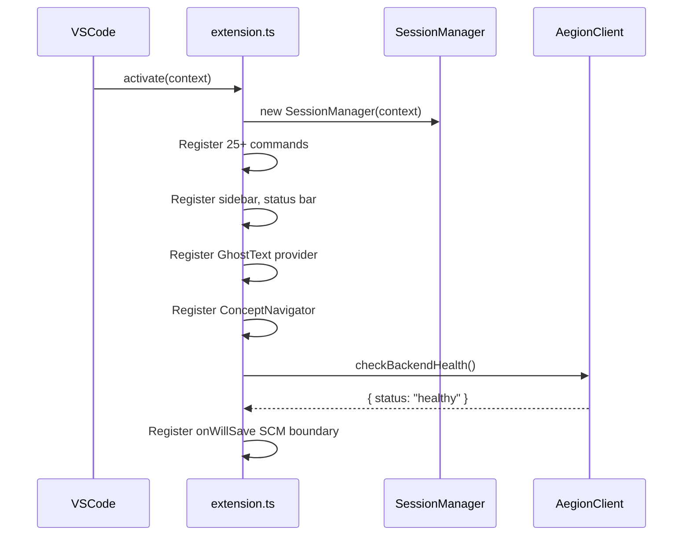

**Components initialized on activation:**

| Component | Purpose |
|-----------|---------|
| `SessionManager` | Tracks active session state, decision/evidence counts |
| `IdentityManager` | Manages user role and permissions |
| `GovernanceStatusBar` | Shows session/governance state in status bar |
| `GhostTextProvider` | Inline code completions via backend |
| `ConceptNavigator` | Navigate evidence graph via quick-pick |
| `AegionSidebarProvider` | Main sidebar webview |
| `DiffManager` | Show AI-generated code diffs |
| `RecoveryViewProvider` | TreeView for draft/orphan session recovery |

---

## 3. Session Lifecycle

A **session** is the core collaboration unit. All proposals, evidence, and decisions are scoped to a session.

### 3.1 Start Session

```
User: Command Palette → "Aegion: Start Session"
```

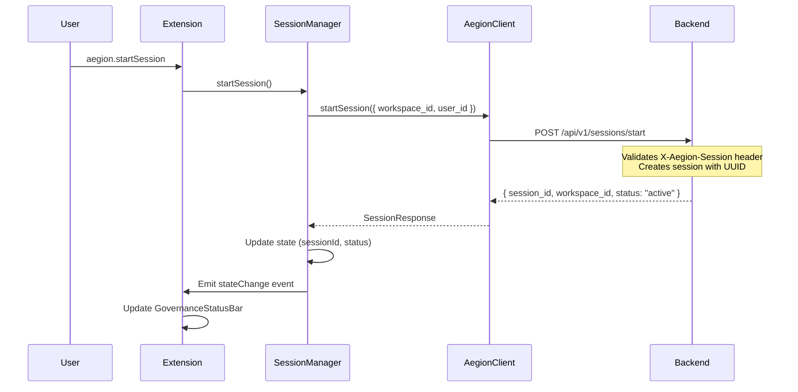

**Backend endpoint**: `POST /api/v1/sessions/start`
**Router**: `sessions.py` → `APIRouter(prefix="/sessions")`

### 3.2 Close Session

```
User: Command Palette → "Aegion: Close Session"
      → Quick pick: "Yes, distill artifacts" or "No, discard"
```

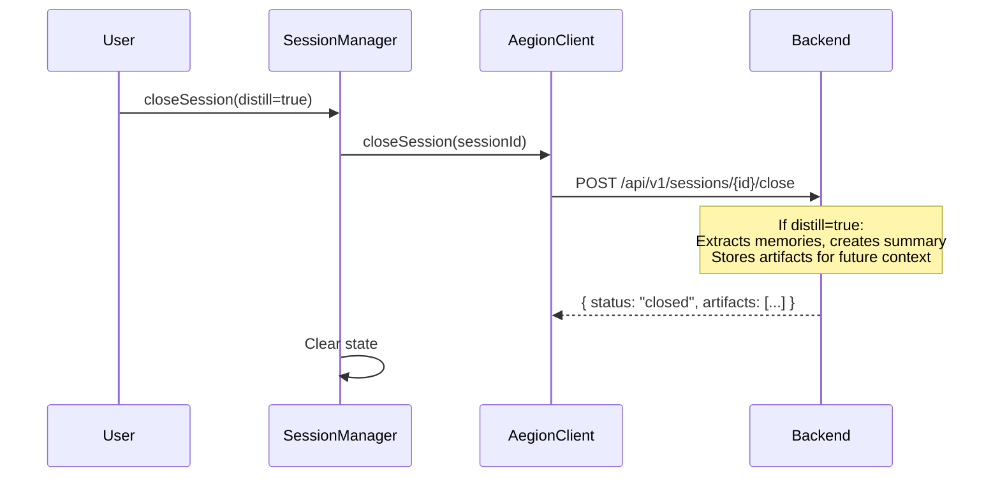

**Backend endpoint**: `POST /api/v1/sessions/{session_id}/close`

### 3.3 Session Recovery

```
Sidebar → Recovery View → TreeView shows Drafts + Orphaned Sessions
```

| Action | Endpoint |
|--------|----------|
| List drafts | `GET /api/v1/sessions/drafts/` |
| List orphans | `GET /api/v1/sessions/orphaned?threshold_minutes=60` |
| Restore draft | `POST /api/v1/sessions/drafts/{id}/restore` |
| Recover session | `POST /api/v1/sessions/{id}/recover` |
| Delete draft | `DELETE /api/v1/sessions/drafts/{id}` |

### 3.4 Session Modes

Sessions support different operational modes:

| Endpoint | Purpose |
|----------|---------|
| `POST /api/v1/sessions/{id}/mode` | Set session mode |
| `GET /api/v1/sessions/{id}/mode` | Get current mode |

### 3.5 SCM Boundary Warning

When a user saves a file **without an active session**, the extension shows a warning:

```
⚠️ Saving ungoverned change in 'filename.ts'. Start a session to track?
    [Start Session] [Ignore]
```

This is registered via `vscode.workspace.onWillSaveTextDocument`.

---

## 4. Proposal & Governance Pipeline

The **proposal** is the central governance unit. Every code change must go through the proposal pipeline.

### 4.1 Create Proposal

```
User: Command Palette → "Aegion: Create Proposal"
```

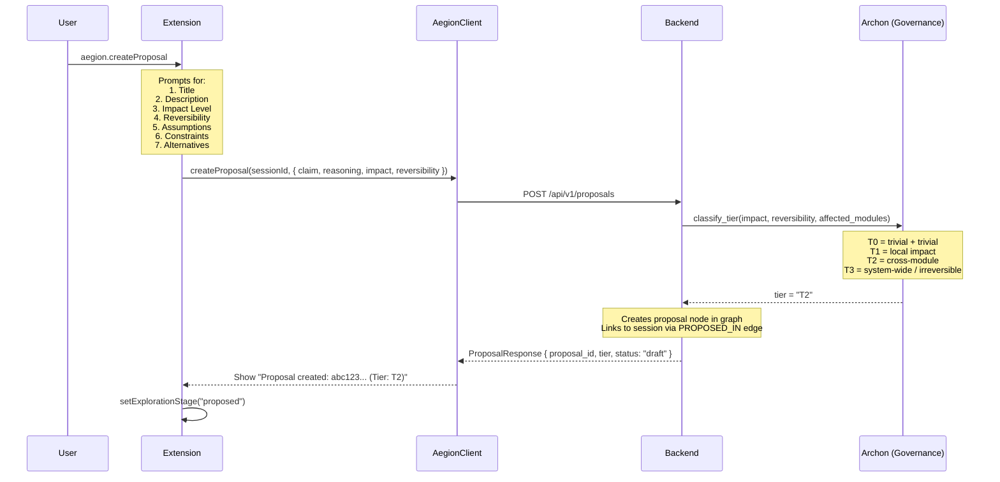

**Backend endpoint**: `POST /api/v1/proposals`

### 4.2 Tier Classification

```
Impact Level    × Reversibility → Tier
─────────────────────────────────────
trivial           trivial        → T0 (auto-approve)
local             easy           → T1 (single approval)
cross_module      moderate       → T2 (architect review)
system_wide       difficult      → T3 (admin-only)
external          irreversible   → T3
```

### 4.3 Approve Proposal

```
User: Command Palette → "Aegion: Approve Proposal"
      → Enter proposal ID
      → See tier label + warning for T2+
      → Enter justification
```

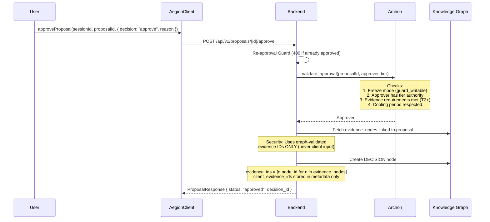

**Security hardening (Sprint 21)**:
- **Evidence ID validation**: Decision records use only graph-validated evidence IDs, never client-provided `request.evidence_ids`
- **Re-approval guard**: Returns `409 Conflict` if proposal already approved (lines 257-264)
- **Client evidence preserved**: `request.evidence_ids` stored in `metadata.client_evidence_ids` for audit trail only

**Backend endpoint**: `POST /api/v1/proposals/{proposal_id}/approve`

### 4.4 Reject Proposal

```
User: Command Palette → "Aegion: Reject Decision"
      → Enter proposal ID → Enter reason
```

**Backend endpoint**: `POST /api/v1/proposals/{proposal_id}/reject`

### 4.5 Review & Vote

Reviews are now **persistently stored** in the knowledge graph (Sprint 21):

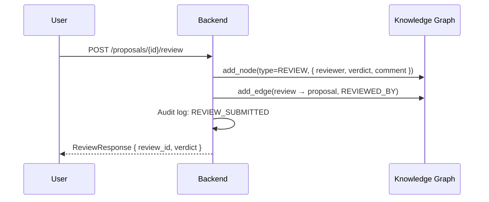

| Endpoint | Purpose |
|----------|---------|
| `POST /proposals/{id}/review` | Submit structured review (persisted as REVIEW node) |
| `POST /proposals/{id}/vote` | Cast governance vote |
| `GET /proposals/{id}` | Get proposal details |
| `GET /proposals/session/{session_id}` | List proposals in session |

---

## 5. AI Council

The AI Council is the primary AI reasoning engine — it provides governed code generation and architectural advice.

### 5.1 Invoke Council (Streaming)

```
User: Command Palette → "Aegion: Invoke AI Council"
      → Enter prompt
```

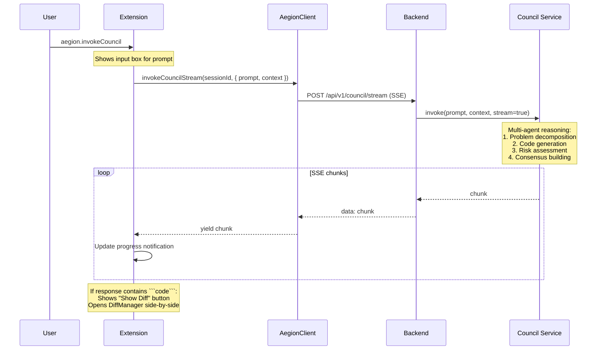

**Backend endpoints**:
- `POST /api/v1/council/invoke` — synchronous response
- `POST /api/v1/council/stream` — SSE streaming response

### 5.2 Council Analytics

| Endpoint | Purpose |
|----------|---------|
| `POST /api/v1/council/analytics/analyze` | Analyze council performance metrics |

---

## 6. Evidence Graph

Evidence nodes are **append-only** — once created, they cannot be modified or deleted. This enforces the governance doctrine that evidence is immutable.

### 6.1 Submit Evidence

| Endpoint | Purpose |
|----------|---------|
| `POST /api/v1/evidence/submit` | Submit evidence for a proposal |
| `POST /api/v1/evidence/{id}/snapshots` | Capture evidence snapshots |
| `GET /api/v1/evidence/{proposal_id}` | Get evidence for a proposal |

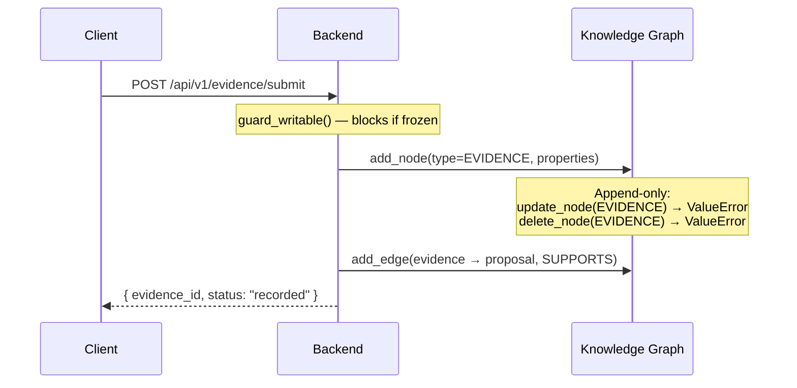

### 6.2 Evidence Decision Graph (EDG)

| Endpoint | Purpose |
|----------|---------|
| `POST /api/v1/edg/traverse` | Traverse the evidence-decision graph |
| `GET /api/v1/edg/query` | Query the graph structure |

### 6.3 Append-Only Enforcement

```python
# In memory_graph.py — evidence and decision nodes are immutable
async def update_node(self, node_id, properties):
    if old_node.node_type in (GraphNodeType.EVIDENCE, GraphNodeType.DECISION):
        raise ValueError("Node is append-only and cannot be modified")

async def delete_node(self, node_id):
    if node.node_type in (GraphNodeType.EVIDENCE, GraphNodeType.DECISION):
        raise ValueError("Node is append-only and cannot be deleted")
```

### 6.4 Node ID Uniqueness

```python
# In memory_graph.py — duplicate IDs are rejected
async def add_node(self, node_type, node_id, properties):
    if node_id in self._nodes:
        raise ValueError(f"Node {node_id} already exists")
```

---

## 7. Decision Management

| Endpoint | Purpose |
|----------|---------|
| `GET /api/v1/decisions` | List all decisions |
| `POST /api/v1/decisions/{id}/supersede` | Supersede a decision |
| `GET /api/v1/decisions/{id}/lineage` | Get decision lineage/provenance |
| `GET /api/v1/decisions/graph` | Get full decision graph |

```
User: Command Palette → "Aegion: Supersede Decision"
      → Enter decision ID → Enter reason → Creates new proposal
```

---

## 8. Architecture & ADRs

Architecture Decision Records (ADRs) document significant architectural decisions.

### 8.1 Endpoints

| Endpoint | Purpose |
|----------|---------|
| `POST /api/v1/architecture/adrs` | Create an ADR |
| `GET /api/v1/architecture/adrs` | List all ADRs |
| `GET /api/v1/architecture/adrs/{id}` | Get ADR by ID |
| `POST /api/v1/architecture/adrs/{id}/accept` | Accept an ADR |
| `POST /api/v1/architecture/adrs/{id}/deprecate` | Deprecate an ADR |
| `GET /api/v1/architecture/adrs/{id}/chain` | Get ADR supersession chain |
| `GET /api/v1/architecture/timeline/{workspace_id}` | Get architecture timeline |
| `POST /api/v1/architecture/snapshots` | Capture state snapshot |
| `GET /api/v1/architecture/snapshots` | List snapshots |
| `GET /api/v1/architecture/state-at/{timestamp}` | View state at a point in time |
| `POST /api/v1/architecture/diff` | Compare two states |
| `POST /api/v1/architecture/adrs/extract` | Auto-extract ADR drafts from decisions |

### 8.2 Generate ADR Flow

```
User: Command Palette → "Aegion: Generate ADR"
      → Enter decision ID
      → ADR generated and opened in editor
```

### 8.3 ADR Graph View

```
User: Command Palette → "Aegion: Show ADR Graph"
      → Opens ADRGraph webview (TreeView: shows ADR hierarchy)
```

---

## 9. Governance Controls

The **Archon** service is the backend governance engine.

### 9.1 Freeze Mode

When freeze mode is active, **all mutating endpoints return 403 Forbidden**.

| Endpoint | Purpose |
|----------|---------|
| `POST /api/v1/governance/freeze` | Activate freeze mode |
| `POST /api/v1/governance/unfreeze` | Deactivate freeze mode |
| `GET /api/v1/governance/status` | Check freeze status |
| `GET /api/v1/governance/policy` | Get governance policy |

### 9.2 Freeze Guard Coverage

Every mutating endpoint calls `guard_writable()`:

```python
from app.services.archon import get_archon, GovernanceError
archon = get_archon()
try:
    archon.guard_writable()  # Raises if frozen
except GovernanceError as e:
    raise HTTPException(status_code=403, detail=str(e))
```

**Protected endpoints** (12 across 5 files):
- `evidence.py`: submit, capture_snapshots
- `architecture.py`: create_adr, accept_adr, deprecate_adr, capture_snapshot, extract_adrs
- `pipelines.py`: create_pipeline, execute_step
- `rejections.py`: record_rejection
- `diff_review.py`: add_comment, resolve_comment, apply_proposal

### 9.3 AI Toggle

| Endpoint | Purpose |
|----------|---------|
| `POST /api/v1/governance/workspaces/{id}/ai-toggle` | Enable/disable AI for workspace |
| `GET /api/v1/governance/workspaces/{id}/ai-status` | Check AI status |

### 9.4 Governance Panel

```
User: Command Palette → "Aegion: Open Governance Center"
      → Opens ArchonUIPanel webview
```

---

## 10. Sentinel — Drift & Risk Monitoring

Sentinel monitors for architectural drift and calculates risk scores.

| Endpoint | Purpose |
|----------|---------|
| `POST /api/v1/sentinel/risk-score` | Calculate risk score for workspace |
| `POST /api/v1/sentinel/heatmap` | Generate risk heatmap |
| `POST /api/v1/sentinel/drift` | Run drift detection |
| `GET /api/v1/sentinel/drift/{workspace_id}/status` | Get drift status |
| `GET /api/v1/sentinel/alerts` | List active alerts |

```
User: Command Palette → "Aegion: Open Risk Observatory"
      → Opens ObservabilityPanel webview
```

---

## 11. Noesis — Cognitive Analytics

Noesis provides cognitive load assessment and impact analysis.

| Endpoint | Purpose |
|----------|---------|
| `POST /api/v1/noesis/cognitive-load` | Assess developer cognitive load |
| `GET /api/v1/noesis/cognitive-load/{user_id}/should-break` | Should the user take a break? |
| `POST /api/v1/noesis/cognitive-load/{user_id}/break` | Record break taken |
| `POST /api/v1/noesis/uncertainty` | Visualize uncertainty |
| `POST /api/v1/noesis/impact-analysis` | Analyze impact of changes |
| `POST /api/v1/noesis/decisions/record` | Record a decision event |
| `GET /api/v1/noesis/decisions/{id}/provenance` | Get decision provenance graph |
| `GET /api/v1/noesis/workspace/{id}/topology` | Get workspace decision topology |

---

## 12. Ghost Text — Inline Completions

Ghost text provides **inline code completions** in the editor, similar to Copilot but governance-aware.

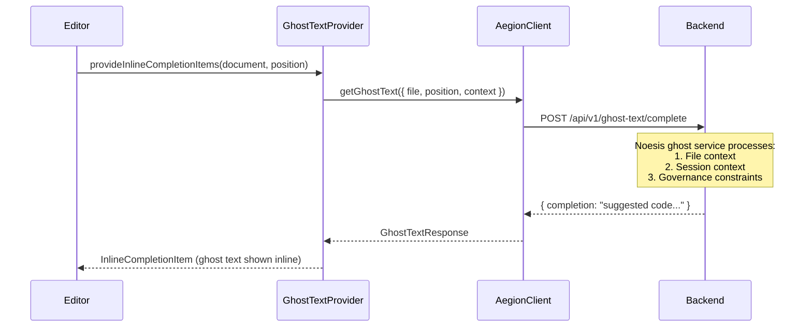

**Backend endpoint**: `POST /api/v1/ghost-text/complete`

---

## 13. Praxis — Code Sandbox

Praxis provides sandboxed code execution with safety controls.

| Endpoint | Purpose |
|----------|---------|
| `POST /api/v1/praxis/execute` | Execute code in sandbox |
| `POST /api/v1/praxis/validate` | Validate code before execution |
| `GET /api/v1/praxis/environments` | List available environments |

**Execution flow**:
1. If Docker is available → isolated container execution
2. If Docker unavailable → **hardened subprocess** (restricted, logged)
3. High-risk actions blocked when Docker unavailable

---

## 14. Chronos — Time Travel & Snapshots

Chronos provides temporal navigation through the project's decision history.

| Endpoint | Purpose |
|----------|---------|
| `GET /api/v1/chronos/timeline` | Get full timeline |
| `GET /api/v1/chronos/events` | List chronological events |
| `POST /api/v1/chronos/snapshot` | Take a point-in-time snapshot |

```
User: Command Palette → "Aegion: Open Architecture Timeline"
      → Opens TimelinePanel webview
      → Chronos Explorer sidebar (TreeView with refresh: aegion.chronos.refresh)
```

---

## 15. Memory & Context

Memory provides durable storage of context, learnings, and artifacts across sessions.

| Endpoint | Purpose |
|----------|---------|
| `POST /api/v1/memory` | Store a memory item |
| `GET /api/v1/memory` | List all memories |
| `GET /api/v1/memory/{id}` | Get memory by ID |
| `DELETE /api/v1/memory/{id}` | Delete memory |
| `POST /api/v1/memory/query` | Semantic search across memories |

```
User: Command Palette → "Aegion: Query Memory"
      → Enter search query
      → Results shown in quick-pick
      → Select to view full JSON
```

```
User: Command Palette → "Aegion: Open Memory & Rules"
      → Opens MemoryRulesPanel webview
```

---

## 16. Rules Engine

Rules are governance constraints that can be evaluated programmatically.

| Endpoint | Purpose |
|----------|---------|
| `POST /api/v1/rules` | Create a rule |
| `GET /api/v1/rules` | List all rules |
| `GET /api/v1/rules/{id}` | Get rule by ID |
| `PUT /api/v1/rules/{id}` | Update a rule |
| `DELETE /api/v1/rules/{id}` | Delete a rule |
| `POST /api/v1/rules/evaluate` | Evaluate rules against context |

---

## 17. Skills Marketplace

Skills are reusable extensions that add new capabilities to Aegion.

| Endpoint | Purpose |
|----------|---------|
| `POST /api/v1/skills` | Register a skill |
| `GET /api/v1/skills` | List available skills |
| `GET /api/v1/skills/{id}` | Get skill details |
| `POST /api/v1/skills/{id}/install` | Install a skill |
| `POST /api/v1/skills/{id}/validate` | Validate a skill |
| `DELETE /api/v1/skills/{id}` | Remove a skill |
| `POST /api/v1/skills/{id}/invoke` | Invoke a skill |
| `POST /api/v1/skills/{id}/invoke-link` | Create invocation link (URL-based) |
| `GET /api/v1/skills/invoke/{token}` | Redeem invocation link |
| `GET /api/v1/skills/{id}/invocations` | List skill invocations |

```
User: Command Palette → "Aegion: Open Skill Catalog"
      → Opens SkillCatalogPanel webview
```

---

## 18. Task Inbox

Tasks represent work items that need attention.

| Endpoint | Purpose |
|----------|---------|
| `POST /api/v1/tasks` | Create a task |
| `GET /api/v1/tasks` | List tasks |
| `GET /api/v1/tasks/{id}` | Get task by ID |
| `PUT /api/v1/tasks/{id}` | Update a task |

```
User: Command Palette → "Aegion: Open Task Inbox"
      → Opens TaskInboxPanel webview
```

---

## 19. Checkpoints — Git Safety

Checkpoints provide git-based safety net for code changes.

| Endpoint | Purpose |
|----------|---------|
| `POST /api/v1/checkpoints` | Create a checkpoint |
| `GET /api/v1/checkpoints` | List checkpoints |
| `GET /api/v1/checkpoints/{id}` | Get checkpoint details |
| `DELETE /api/v1/checkpoints/{id}` | Delete a checkpoint |

```
User: Command Palette → "Aegion: Open Checkpoints"
      → Opens CheckpointPanel webview
```

---

## 20. Collaboration & Presence

Real-time collaboration features for team development.

### 20.1 Presence

| Endpoint | Purpose |
|----------|---------|
| `POST /api/v1/presence/heartbeat` | Send heartbeat (I'm here) |
| `GET /api/v1/presence` | List who's online |
| `GET /api/v1/presence/{user_id}` | Get user presence |
| `POST /api/v1/presence/leave` | Leave (go offline) |

### 20.2 Collaboration Panel

```
User: Command Palette → "Aegion: Open Collaboration"
      → Opens CollaborationPanel webview
```

---

## 21. War Room — Incident Response

War Room provides a command center for handling production incidents.

| Endpoint | Purpose |
|----------|---------|
| `GET /api/v1/warroom/overview` | Get war room overview |
| `POST /api/v1/warroom/incidents` | Create an incident |
| `GET /api/v1/warroom/incidents` | List incidents |
| `GET /api/v1/warroom/incidents/{id}` | Get incident details |
| `PUT /api/v1/warroom/incidents/{id}` | Update incident |

**Incident model** includes `workspace_id` for workspace-scoped isolation (Sprint 21).

```
User: Command Palette → "Aegion: Open War Room"
      → Opens WarRoomPanel webview
```

---

## 22. Cloud Delegation

Cloud delegation enables running tasks on remote infrastructure.

| Endpoint | Purpose |
|----------|---------|
| `POST /api/v1/delegation/deploy` | Deploy to cloud |
| `GET /api/v1/delegation/deployments/{id}` | Get deployment status |
| `GET /api/v1/delegation/resources` | List cloud resources |
| `GET /api/v1/delegation/resources/{id}/logs` | Get resource logs |
| `GET /api/v1/delegation/health` | Cloud health check |
| `POST /api/v1/delegation/runs` | Trigger remote run |
| `GET /api/v1/delegation/runs` | List remote runs |
| `GET /api/v1/delegation/runs/{id}` | Get run status |

```
User: Command Palette → "Aegion: Open Cloud Delegate"
      → Opens DelegatePanel webview
```

---

## 23. Diff Review & Proposals

Inline diff review for code change proposals.

| Endpoint | Purpose |
|----------|---------|
| `POST /api/v1/proposals/{id}/comments` | Add inline diff comment |
| `PATCH /api/v1/proposals/{id}/comments/{cid}/resolve` | Resolve a comment |
| `GET /api/v1/proposals/{id}/comments` | List comments |
| `POST /api/v1/proposals/{id}/apply` | Apply proposed changes |

```
User: Command Palette → "Aegion: Open Multi-File Review"
      → Opens MultiFileReviewPanel webview
```

---

## 24. Audit Trail

Complete audit log of all governance actions.

| Endpoint | Purpose |
|----------|---------|
| `POST /api/v1/audit/grants` | Create audit grant |
| `DELETE /api/v1/audit/grants/{id}` | Revoke audit grant |
| `GET /api/v1/audit/grants/me` | List my audit grants |
| `POST /api/v1/audit/check` | Check audit permissions |
| `POST /api/v1/audit/events` | Record audit event |
| `GET /api/v1/audit/events` | List audit events |
| `GET /api/v1/audit/replay/{task_id}` | Replay audit for task |
| `GET /api/v1/audit/stats` | Get audit statistics |

```
User: Command Palette → "Aegion: Open Audit Log"
      → Opens AuditLogPanel webview
```

---

## 25. ChatOps Integration

Slack and webhook-based notifications.

| Endpoint | Purpose |
|----------|---------|
| `POST /api/v1/chatops/slack/webhook` | Receive Slack webhook |
| `POST /api/v1/chatops/slack/events` | Handle Slack events |
| `GET /api/v1/chatops/slack/install` | Start Slack OAuth install |
| `POST /api/v1/chatops/webhooks/configure` | Configure webhooks |
| `GET /api/v1/chatops/webhooks` | List all webhooks |
| `GET /api/v1/chatops/webhooks/{workspace_id}` | Get workspace webhook |
| `DELETE /api/v1/chatops/webhooks/{workspace_id}` | Remove webhook |
| `POST /api/v1/chatops/notify` | Send notification |
| `GET /api/v1/chatops/notifications/log` | View notification log |

---

## 26. MCP Tool Server

Model Context Protocol tools for AI agent integration.

| Endpoint | Purpose |
|----------|---------|
| `GET /api/v1/tools` | List available tools |
| `GET /api/v1/tools/{name}` | Get tool details + schema |
| `POST /api/v1/tools/{name}` | Execute a tool |
| `PUT /api/v1/tools/{name}` | Register/update a tool |
| `DELETE /api/v1/tools/{name}` | Unregister a tool |

---

## 27. Terminal & Browser Tools

### 27.1 Terminal

| Endpoint | Purpose |
|----------|---------|
| `POST /api/v1/terminal/execute` | Execute terminal command |
| `GET /api/v1/terminal/profiles` | List terminal profiles |
| `GET /api/v1/terminal/history` | Get command history |

### 27.2 Browser

| Endpoint | Purpose |
|----------|---------|
| `POST /api/v1/tools/browser/fetch` | Fetch URL content |
| `POST /api/v1/tools/browser/browse` | Browse and interact |
| `POST /api/v1/tools/browser/extract` | Extract data from page |
| `POST /api/v1/tools/browser/screenshot` | Take screenshot |

---

## 28. AI Commands

Quick AI actions on selected code.

| Endpoint | Purpose |
|----------|---------|
| `POST /api/v1/ai/transform` | Transform/refactor code |
| `POST /api/v1/ai/explain` | Explain code |
| `POST /api/v1/ai/debug` | Debug code issues |

---

## 29. Model Routing

Manage and switch between AI model providers.

| Endpoint | Purpose |
|----------|---------|
| `GET /api/v1/models` | List available models |
| `GET /api/v1/models/active` | Get active model |
| `PUT /api/v1/models/active` | Switch active model |
| `POST /api/v1/models/register` | Register new model |

---

## 30. Agent Identity & Verification

Cryptographic identity for AI agents operating within governance.

| Endpoint | Purpose |
|----------|---------|
| `POST /api/v1/agents` | Register an agent |
| `GET /api/v1/agents` | List agents |
| `GET /api/v1/agents/{id}` | Get agent details |
| `POST /api/v1/agents/{id}/verify` | Start verification challenge |
| `POST /api/v1/agents/{id}/verify/complete` | Complete verification |
| `POST /api/v1/agents/{id}/claims` | Submit a claim |
| `GET /api/v1/agents/{id}/claims` | List claims |
| `POST /api/v1/agents/{id}/claims/{cid}/verify` | Verify a claim |
| `DELETE /api/v1/agents/{id}` | Remove an agent |

---

## 31. Secrets Vault

Secure secret storage with time-bound access tokens.

| Endpoint | Purpose |
|----------|---------|
| `POST /api/v1/secrets` | Store a secret |
| `GET /api/v1/secrets/{key}/token` | Get time-limited access token |
| `POST /api/v1/secrets/redeem` | Redeem token to retrieve secret |
| `DELETE /api/v1/secrets/{key}` | Delete a secret |

---

## 32. Rejection Learning

When proposals are rejected, the system captures learnings for future reference.

| Endpoint | Purpose |
|----------|---------|
| `POST /api/v1/rejections` | Record rejection artifact |
| `GET /api/v1/rejections/{id}` | Get rejection details |
| `POST /api/v1/rejections/query` | Search rejections |
| `GET /api/v1/rejections/stats/{workspace_id}` | Workspace rejection stats |
| `GET /api/v1/rejections/stats` | Global rejection stats |

---

## 33. Decision Pipelines

Structured, step-by-step decision workflows. **Pipeline state is durably persisted** via `JsonFileStore` (Sprint 21).

| Endpoint | Purpose |
|----------|---------|
| `POST /api/v1/pipelines` | Create a pipeline |
| `GET /api/v1/pipelines/{id}` | Get pipeline |
| `POST /api/v1/pipelines/{id}/step` | Execute next step |
| `GET /api/v1/pipelines` | List pipelines |
| `GET /api/v1/pipelines/templates/all` | List pipeline templates |

### Pipeline Templates

| Template | Tiers | Steps |
|----------|-------|-------|
| T1 Simple Review | T0, T1 | AI review → auto test |
| T2 Full Review | T2 | AI review → parent escalation → integration test → peer review |
| T3 War Room | T3 | AI council → war room → security audit → perf test → architect sign-off |

---

## 34. Reasoning Chains

Structured reasoning traces for AI transparency.

| Endpoint | Purpose |
|----------|---------|
| Router prefix `/reasoning` | Reasoning chain endpoints |

---

## 35. Admin Dashboard

System administration and monitoring.

| Endpoint | Purpose |
|----------|---------|
| `GET /api/v1/admin/usage` | Usage statistics |
| `GET /api/v1/admin/policy-dashboard` | Policy compliance stats |
| `GET /api/v1/admin/env` | Get environment config |
| `POST /api/v1/admin/env` | Update environment config |

```
User: Command Palette → "Aegion: Open Admin Dashboard"
      → Opens AdminDashboardPanel webview
```

---

## 36. Event Streaming (SSE)

Server-Sent Events for real-time updates.

| Endpoint | Purpose |
|----------|---------|
| `GET /api/v1/events/stream/{workspace_id}` | Subscribe to workspace events |
| `POST /api/v1/events/broadcast/{workspace_id}` | Broadcast event to workspace |

---

## 37. WebSocket Real-Time

WebSocket connections for bi-directional real-time communication. **Authentication is now token-based** (Sprint 21).

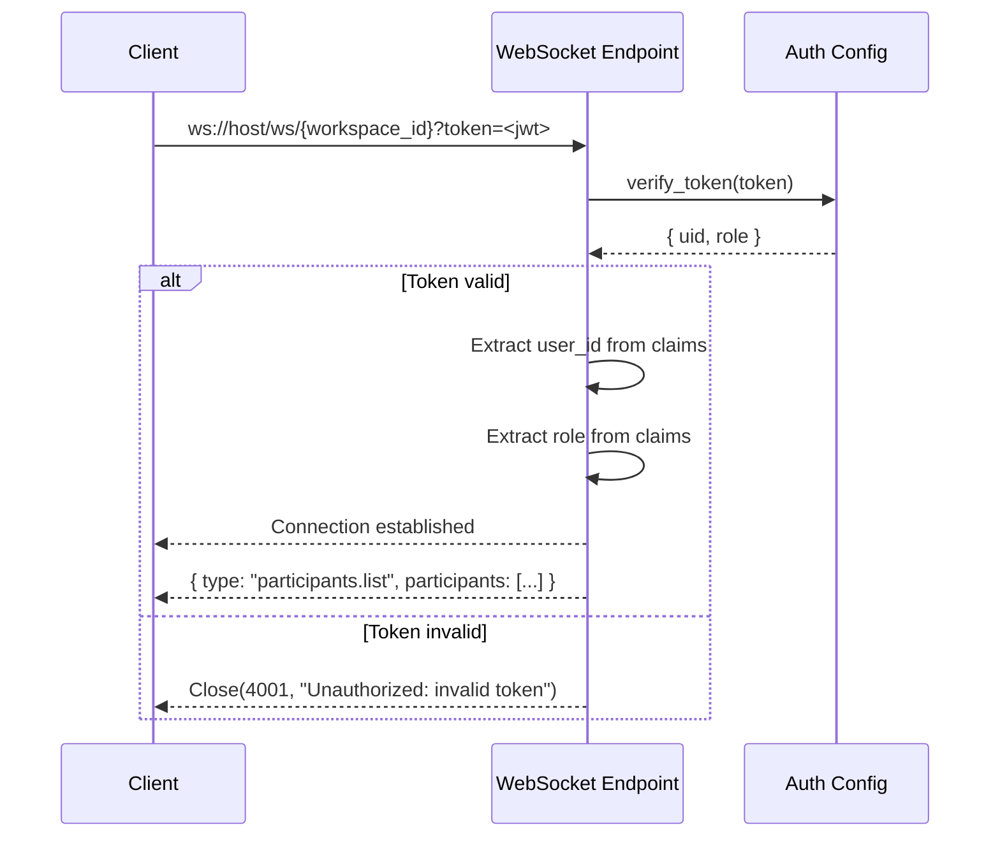

**Message Types (Client → Server):**
- `join_session` — Join a governance session
- `leave_session` — Leave current session
- `cursor_update` — Share cursor position
- `state_sync` — Request state synchronization

**Message Types (Server → Client):**
- `participant.joined` — New participant
- `participant.left` — Participant left
- `cursor.updated` — Cursor from another user
- `state.changed` — Session state changed
- `proposal.updated` — Proposal modified

---

## 38. Health & Readiness

| Endpoint | Purpose |
|----------|---------|
| `GET /health` | Root-level health check (bypasses SessionGuard) |
| `GET /api/v1/health/...` | API-level health endpoints |

---

## 39. Configuration & Networking

### 39.1 VS Code Settings

```json
{
    "aegion.backendUrl": "http://localhost:8000",
    "aegion.autoStartSession": false,
    "aegion.clientGenerationMode": "automatic-with-review"
}
```

| Setting | Default | Purpose |
|---------|---------|---------|
| `aegion.backendUrl` | `http://localhost:8000` | Backend API server URL |
| `aegion.autoStartSession` | `false` | Auto-start session on workspace open |
| `aegion.clientGenerationMode` | `automatic-with-review` | How API client types are generated |

### 39.2 Backend Configuration

```python
# app/core/config.py
class Settings:
    api_prefix: str = "/api/v1"
    environment: str = "development"
```

### 39.3 Environment Variables

| Variable | Default | Purpose |
|----------|---------|---------|
| `AEGION_AUTH_ADAPTER` | `firebase` | Auth provider: `firebase`, `jwt`, `mock` |
| `AEGION_JWT_ISSUER` | — | JWT issuer URL (for JWT/OIDC) |
| `AEGION_JWT_AUDIENCE` | `aegion-api` | JWT audience claim |
| `AEGION_JWT_ALGORITHM` | `RS256` | JWT signing algorithm |
| `AEGION_JWKS_URL` | — | JWKS endpoint for key retrieval |
| `AEGION_JWT_SECRET` | — | Shared secret for HS256 |
| `AEGION_REQUIRE_TLS` | `true` | Enforce TLS for auth endpoints |
| `AEGION_DEBUG` | `false` | Enable mock tokens (development only) |
| `AEGION_STORE_BACKEND` | — | Durable store backend selector |

### 39.4 URL Resolution

```
VS Code Extension                              Backend
┌──────────────────────────────────────┐       ┌─────────────────────┐
│ aegion.backendUrl = "http://host:8000"│       │ api_prefix = /api/v1│
│ + Endpoints.sessions.start()         │       │                     │
│ = "/api/v1/sessions/start"           │──────▶│ POST /sessions/start│
│                                      │       │ (under /api/v1)     │
└──────────────────────────────────────┘       └─────────────────────┘
```

---

## 40. Middleware & Guards

### 40.1 SessionGuard Middleware

Every request (except `/health`) requires session headers:

```
X-Aegion-Session: <session-id>
X-Aegion-Intent: <action-intent>
```

### 40.2 Freeze Guard

All mutating endpoints are protected by `guard_writable()`:

```python
if archon._freeze_mode:
    raise GovernanceError("System is in FREEZE mode - mutations blocked")
```

### 40.3 Re-Approval Guard

Proposals cannot be approved twice:

```python
# proposals.py lines 257-264
existing_decisions = await _graph_service.graph.get_edges(...)
if any(e.edge_type == GraphEdgeType.APPROVED_BY for e in existing_decisions):
    raise HTTPException(status_code=409, detail="Proposal already approved")
```

### 40.4 Authentication

Endpoints requiring user context use `Depends(get_current_user)` which returns an `AuthorityContext` with:
- `user_id`
- `role` (Developer, Architect, Admin)
- `permissions` list
- `can_propose_t1`, `can_propose_t2`, `can_approve_t1`, `can_approve_t2`

---

## 41. Authentication & Authorization

> **Added Sprint 12-21**

### 41.1 Multi-Provider Auth

Aegion supports multiple authentication providers via `auth_config.py`:

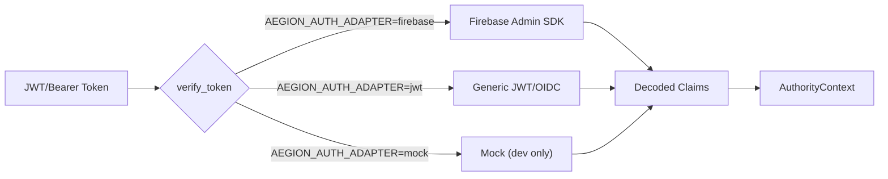

| Provider | Use Case | Config |
|----------|----------|--------|
| `firebase` | Production (GCP) | Firebase Admin SDK initialized |
| `jwt` | Self-hosted (Auth0, Keycloak) | `AEGION_JWKS_URL` or `AEGION_JWT_SECRET` |
| `mock` | Development only | `AEGION_DEBUG=true`, tokens: `mock-<uid>` |

### 41.2 Authority Model

```python
# Doctrine: "Separate auth from authority"
# Authentication = Identity ("Who is this?")
# Authorization  = Power    ("What can they do?")

class AuthorityContext:
    user_id: str
    role: Role          # ADMIN | ARCHITECT | DEVELOPER | VIEWER
    can_propose_t1: bool
    can_propose_t2: bool
    can_approve_t1: bool
    can_approve_t2: bool
    can_write_memory: bool
    allowed_modules: Set[str]
```

### 41.3 Role Capabilities

| Role | Propose T1 | Propose T2 | Approve T1 | Approve T2 |
|------|-----------|-----------|-----------|-----------|
| Admin | ✅ | ✅ | ✅ | ✅ |
| Architect | ✅ | ✅ | ✅ | ❌ |
| Developer | ✅ | ❌ | ❌ | ❌ |
| Viewer | ❌ | ❌ | ❌ | ❌ |

---

## 42. Knowledge Graph Infrastructure

> **Added Sprint 21**

### 42.1 Shared Graph Provider

**Doctrine**: *"One graph. One truth. All modules speak to the same knowledge base."*

All API modules share a single `InMemoryKnowledgeGraph` instance via `graph_provider.py`:

```python
from app.services.graph_provider import get_shared_graph_service

_graph_service = get_shared_graph_service()  # Same instance everywhere
```

**Modules using shared graph**: proposals, evidence, analytics, sessions, reasoning, architecture

### 42.2 Graph Node Types

| Type | Immutability | Purpose |
|------|-------------|---------|
| `SOURCE` | Mutable | External data sources |
| `EVIDENCE` | **Append-only** | Governance evidence (cannot be updated or deleted) |
| `DECISION` | **Append-only** | Decision records (cannot be updated or deleted) |
| `PROPOSAL` | Mutable | Code change proposals |
| `SESSION` | Mutable | Governance sessions |
| `USER` | Mutable | User identities |
| `WORKSPACE` | Mutable | Workspace containers |
| `REVIEW` | **Append-only** | Peer reviews on proposals |

### 42.3 Graph Edge Types

| Edge | Meaning |
|------|---------|
| `SUPPORTS` | Evidence supports a proposal |
| `PROPOSED_IN` | Proposal created in a session |
| `SUPERSEDES` | Decision supersedes another |
| `CREATED_BY` | Node created by user |
| `APPROVED_BY` | Proposal approved by user |
| `REJECTED_BY` | Proposal rejected by user |
| `REVIEWED_BY` | Review linked to proposal |
| `BELONGS_TO` | Entity belongs to workspace |
| `DEPENDS_ON` | Dependency relationship |
| `RELATED_TO` | General relationship |

---

## 43. Durable Storage & Crash Safety

> **Added Sprint 21**

### 43.1 Architecture

**Doctrine**: *"Data survives crashes. Writes are atomic. Sessions are never lost."*

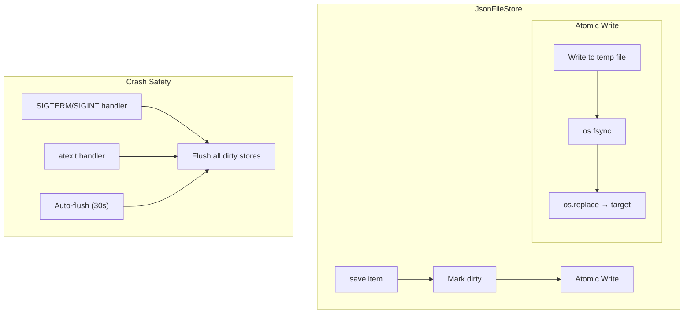

### 43.2 Crash Safety Mechanisms

| Mechanism | Trigger | Purpose |
|-----------|---------|---------|
| Atomic writes | Every save | temp-file → `os.fsync()` → `os.replace()` prevents corruption |
| Signal handlers | SIGTERM, SIGINT | Flushes all dirty stores before process exit |
| atexit handler | Clean shutdown | Last-resort save on normal exit |
| Auto-flush | Every 30 seconds | Background task saves dirty stores periodically |
| Dirty tracking | On mutation | Only writes when data actually changed |

### 43.3 Usage

```python
from app.services.durable_store import JsonFileStore

store = JsonFileStore(
    file_path="data/pipelines.json",
    model_class=DecisionPipeline,
    key_field="pipeline_id",
    auto_flush_interval=30.0,
)

await store.save(pipeline)          # Save (marks dirty, writes atomically)
pipeline = await store.get(id)      # Load by key
all_items = await store.list_all()  # Load all
await store.delete(id)              # Remove
await store.flush()                 # Force immediate write
```

### 43.4 Services Using Durable Store

| Service | File | Key Field |
|---------|------|-----------|
| Pipelines | `data/pipelines.json` | `pipeline_id` |
| Sessions/Drafts | `data/drafts.json` | `session_id` |

---

## 44. Observability & Tracing

> **Added Sprint 14-16**

### 44.1 Structured Logging

```python
# app/core/logging.py
logger.audit(
    action="PROPOSAL_APPROVED",
    actor=user_id,
    target=proposal_id,
    justification="T2 evidence requirements met",
    metadata={"tier": "T2", "evidence_count": 3}
)
```

Every governance action emits a structured audit log with: `action`, `actor`, `target`, `justification`, `metadata`, `timestamp`.

### 44.2 Cloud Logging

`app/core/cloud_logging.py` provides Google Cloud Logging integration for production environments.

### 44.3 Metrics

`app/core/metrics.py` exposes Prometheus-compatible metrics:
- Request latency histograms
- Active session gauges
- Proposal/decision counters
- Error rate counters

### 44.4 Distributed Tracing

`app/core/tracing.py` provides OpenTelemetry tracing integration for request correlation across services.

---

## 45. Data Governance & Isolation

> **Added Sprint 17-21**

### 45.1 Workspace Scoping

All entities are scoped to workspaces:
- **Proposals** → `workspace_id` field
- **Decisions** → `workspace_id` field  
- **Incidents** → `workspace_id` field (Sprint 21)
- **Pipelines** → `workspace_id` field
- **Evidence** → Scoped via proposal linkage

### 45.2 Immutability Doctrine

The following entities are **append-only** in the knowledge graph:

| Entity | Can Create | Can Update | Can Delete |
|--------|-----------|-----------|-----------|
| Evidence | ✅ | ❌ `ValueError` | ❌ `ValueError` |
| Decision | ✅ | ❌ `ValueError` | ❌ `ValueError` |
| Review | ✅ | ❌ | ❌ |
| Proposal | ✅ | ✅ (status only) | ❌ |
| Session | ✅ | ✅ | ❌ |

### 45.3 Security Invariants

| Invariant | Enforcement | Location |
|-----------|------------|----------|
| No client evidence injection | Graph-validated IDs only | `proposals.py:265-284` |
| No duplicate approvals | 409 on re-approval | `proposals.py:257-264` |
| No mutations during freeze | `guard_writable()` | 12 endpoints across 5 files |
| No duplicate node IDs | ValueError on collision | `memory_graph.py:48-52` |
| WebSocket requires auth token | 4001 close on invalid | `websocket.py:210-222` |

---

## Complete Command Reference

| VS Code Command | Action |
|-----------------|--------|
| `aegion.startSession` | Start governed session |
| `aegion.closeSession` | Close session (with/without distillation) |
| `aegion.showSessionMenu` | Quick session actions menu |
| `aegion.createProposal` | Create governance proposal |
| `aegion.invokeCouncil` | Ask AI Council |
| `aegion.approveProposal` | Approve a proposal |
| `aegion.rejectDecision` | Reject a proposal |
| `aegion.supersedeDecision` | Supersede a decision |
| `aegion.generateADR` | Generate ADR from decision |
| `aegion.queryMemory` | Search Chronos memory |
| `aegion.showGovernancePolicy` | View governance policy |
| `aegion.setRole` | Set user role |
| `aegion.openDashboard` | Open main dashboard |
| `aegion.openGovernanceCenter` | Open Archon governance UI |
| `aegion.openSessionExplorer` | Open session explorer |
| `aegion.openSystemHealth` | Open health/failure mode panel |
| `aegion.openObservability` | Open risk observatory |
| `aegion.openTimeline` | Open architecture timeline |
| `aegion.openTaskInbox` | Open task inbox |
| `aegion.openCheckpoints` | Open checkpoints panel |
| `aegion.openMemoryRules` | Open memory & rules panel |
| `aegion.openSkillCatalog` | Open skill catalog |
| `aegion.openCollaboration` | Open collaboration panel |
| `aegion.openWarRoom` | Open war room |
| `aegion.openCloudDelegate` | Open cloud delegation |
| `aegion.openAuditLog` | Open audit log viewer |
| `aegion.openAdminDashboard` | Open admin dashboard |
| `aegion.openMultiFileReview` | Open multi-file review |
| `aegion.showADRGraph` | Show ADR graph |
| `aegion.chronos.refresh` | Refresh Chronos explorer |
| `aegion.sentinel.refresh` | Refresh Sentinel explorer |
| `aegion.navigateConcept` | Navigate evidence graph concepts |

---

## End-to-End Example: Full Governance Flow

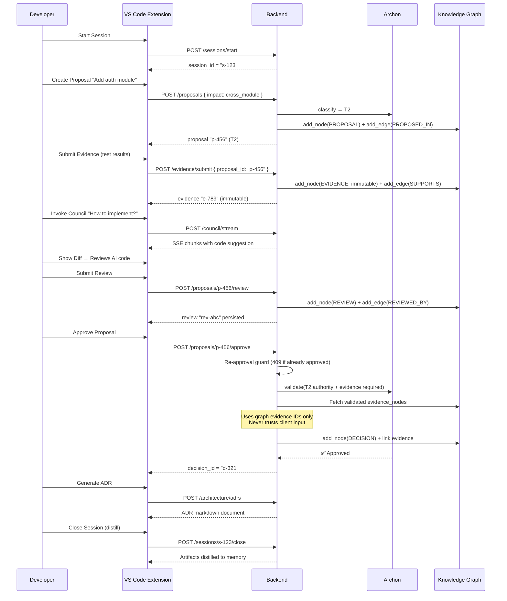
